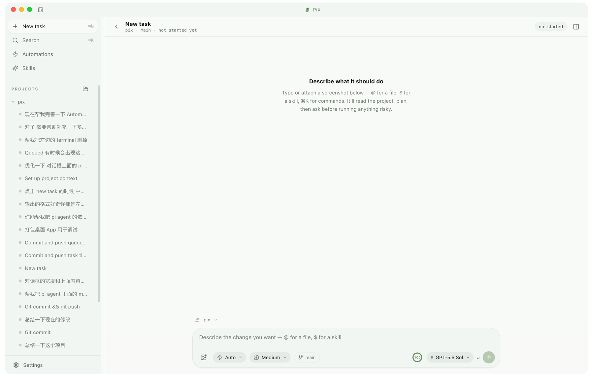
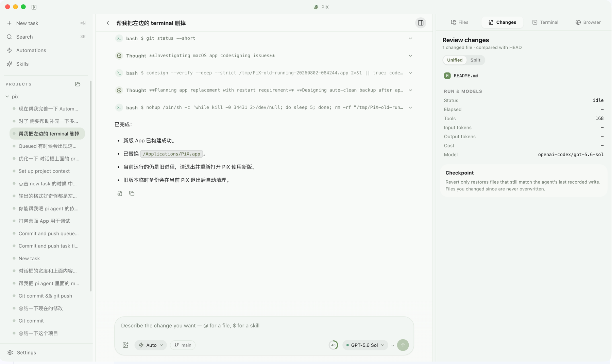
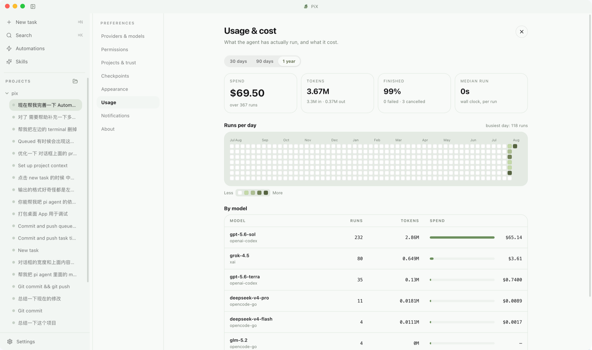

<p align="center">
  
</p>

<h1 align="center">PiX</h1>

<p align="center">
  基于 <a href="https://github.com/earendil-works/pi">Pi Agent SDK</a> 的本地桌面编程助手。<br />
  把任务交给 Agent，清楚地看见执行过程，审查每一处改动，并随时安全回退。
</p>

<p align="center">
  <a href="https://github.com/penouc/pix/actions/workflows/ci.yml"></a>
  
  
  
  <a href="https://pix.penglei.dev"></a>
</p>

<p align="center">
  <a href="#快速开始">快速开始</a> ·
  <a href="#核心能力">核心能力</a> ·
  <a href="#安全模型">安全模型</a> ·
  <a href="#项目结构">项目结构</a> ·
  <a href="./docs/product-and-engineering-plan.md">工程计划</a>
</p>

---

<p align="center">
  <a href="./docs/assets/pix-workbench.png">
    
  </a>
</p>

<p align="center"><sub>本地项目、任务历史、权限模式、模型选择与上下文输入集中在一个工作台中。</sub></p>

## PiX 是什么？

PiX 是一个运行在本机的 Coding Agent 工作台。它使用 Pi 处理多 Provider、多模型、工具调用与 Agent 循环；PiX 则负责桌面交互、Workspace Trust、权限审批、Git Diff、检查点恢复和本地持久化。

```text
打开本地项目 → 描述任务 → Agent 读写代码并运行命令 → 审查 Diff → 保留或回退
```

它不是一个完整 IDE，也不试图把执行过程藏在聊天框后面。PiX 的重点是让真实的编码任务保持**可见、可控、可审查、可恢复**。

> [!IMPORTANT]
> PiX 目前处于积极开发阶段，优先支持 **macOS Apple Silicon**。正式发布构建会签名并公证；本地开发打包仍为未签名。不建议把未签名构建当作无人监管的生产执行器。

## 核心能力

| 能力 | 说明 |
|---|---|
| **本地项目工作台** | 打开 Git 项目、确认 Workspace Trust、管理项目与历史任务；文件和命令默认在本机执行。 |
| **真实 Agent 运行** | 基于 Pi Agent SDK，支持 Provider 登录、模型切换、Thinking Level、流式回复、工具调用、停止和 Follow-up。 |
| **上下文输入** | 使用 `@` 引用项目文件、附加图片，使用 `$` 快速选择标准 `/skill:name` Skill。 |
| **权限与审计** | Main Process 统一判断工具风险；支持 Ask、Auto reads、Read-only，并记录审批与自动决策。 |
| **Diff 与精确恢复** | 多文件 Diff、任务前快照、写入前内容备份、并发修改检测，以及按文件或整轮安全回退。 |
| **Automations** | 保存 Prompt，通过手动、间隔、每日或任务完成事件触发；每个 Automation 都有独立审批模式。 |
| **Skills** | 发现 Pi 标准的全局与项目 Skill，支持搜索、作用域筛选、Composer 调用和可安装示例。 |
| **本地终端与搜索** | 工作区受限终端、项目文件树、跨项目搜索、Session 搜索和诊断导出。 |

### 界面预览

<p align="center">
  <a href="./docs/assets/pix-agent-run.png">
    
  </a>
</p>
<p align="center"><sub>Agent 执行过程、工具调用、完成总结与 Changes 审查面板。</sub></p>

<p align="center">
  <a href="./docs/assets/pix-usage.png">
    
  </a>
</p>
<p align="center"><sub>本地 Usage & Cost：运行次数、Token、费用趋势与模型分布。</sub></p>

### 一次任务的完整路径

1. 打开本地项目并确认信任。
2. 选择已配置的 Provider、Model 和 Thinking Level。
3. 输入任务；可以通过 `@file`、图片和 `$skill` 补充上下文。
4. 查看流式回复、思考过程、工具调用和权限请求。
5. Agent 修改代码并运行 lint、test 或 build。
6. 在多文件 Diff 中审查结果；继续调整、保留修改，或通过检查点精确回退。

## 快速开始

### 环境要求

- macOS（当前打包目标为 Apple Silicon）
- Node.js 20 或更高版本
- pnpm 10.15.0
- Git

### 从源码运行

```bash
git clone https://github.com/penouc/pix.git
cd pix
pnpm install
pnpm dev
```

启动后：

1. 从左侧栏打开一个本地项目。
2. 确认 Workspace Trust。
3. 在 **Settings → Providers** 中通过订阅登录或 API Key 配置 Provider。
4. 创建 **New task**，选择模型并发送第一条任务。

模型服务也可以选择 [OpenCode Go](https://opencode.ai/go?ref=RRWCDRNFVQ)（推广链接）。

离线开发 UI 时可以使用 Fake Runtime：

```bash
PI_DESKTOP_FAKE_RUNTIME=1 pnpm dev
```

### 构建 macOS 应用

```bash
pnpm package:dir
```

构建结果位于：

```text
apps/desktop/release/mac-arm64/PiX.app
```

生成 DMG：

```bash
pnpm --filter @pi-desktop/desktop package:dmg
```

> 本地 `package:dir` / `package:dmg` 仍是未签名构建，便于开发验证。正式分发由 Release workflow 签名并公证；证书与 secrets 配置见 [macOS Signing](./docs/macos-signing.md)。

## 自动发布

仓库通过 [Release workflow](./.github/workflows/release.yml) 自动生成 GitHub Release。推送符合语义化版本格式的 `v*` Tag 后，GitHub Actions 会依次：

1. 安装锁定依赖并运行 TypeScript 与测试检查。
2. 构建 workspace packages 与 Desktop。
3. 用 Developer ID 签名并公证 Apple Silicon DMG / ZIP，把 Tag 版本写入应用 metadata。
4. 验证 app bundle、asar 和 native modules。
5. 创建 GitHub Release、自动生成 Release Notes，并上传 DMG、ZIP、`latest-mac.yml`（供应用内自动更新）。

发布新版本：

```bash
git switch main
git pull --ff-only
git tag v0.2.0
git push origin v0.2.0
```

版本 Tag 必须类似 `v0.2.0` 或 `v0.2.0-beta.1`。Release 仅由 Tag 触发，普通的 `main` 提交不会产生安装包。

> [!IMPORTANT]
> Release 需要 GitHub Actions secrets：`CSC_LINK`、`CSC_KEY_PASSWORD`、`APPLE_API_KEY_BASE64`、`APPLE_API_KEY_ID`、`APPLE_API_ISSUER`。完整步骤见 [macOS Signing](./docs/macos-signing.md)。
## 安全模型

PiX 不把 Renderer 当作可信执行环境：

```text
React Renderer
      │ typed IPC + Zod
      ▼
Electron Main ── Workspace Trust / Permission Policy / Audit / Checkpoint
      │
      ▼
AgentRuntime → Pi Agent SDK → Provider / Model
      │
      ▼
Local Workspace / Git / Child Processes
```

关键边界：

- Renderer 关闭 Node Integration，不能直接访问文件系统、Shell、Keychain 或 SQLite。
- 所有 IPC 输入、输出和 Agent Event 都经过 Zod 校验。
- 权限决策只发生在 Main Process；UI 只负责展示请求和提交选择。
- `.env`、`.git/**`、`~/.ssh/**`、工作区外路径、`git push` 等策略底线不会被 Automation 的自动审批绕过。
- Git Diff 只用于展示；恢复以任务前基线和写入前快照为准。
- 回退前检查文件当前状态，发现用户并发修改时不会静默覆盖。

完整设计见 [Architecture](./docs/architecture.md)、[Agent Runtime Contract](./docs/agent-runtime-contract.md) 和 [Unattended Automations ADR](./docs/decisions/0003-unattended-automations.md)。

## 技术栈

| 层 | 技术 |
|---|---|
| Desktop | Electron 36 |
| UI | React 19、TypeScript、Tailwind CSS 4 |
| Agent | Pi Agent SDK 0.83.0 |
| Async state | TanStack Query、Zustand |
| Protocol | Typed IPC、Zod |
| Diff | `@pierre/diffs` |
| Persistence | SQLite、JSON configuration、macOS Keychain / safeStorage |
| Testing | Vitest、Playwright、固定 Agent evaluation fixtures |
| Packaging | electron-builder |

## 项目结构

```text
apps/
├─ desktop/                 Electron Main / Preload / React Renderer
└─ website/                 PiX 宣传站点
packages/
├─ protocol/                IPC commands、Zod schemas、DesktopAgentEvent
├─ agent-domain/            AgentRuntime 边界、状态机、领域错误
├─ agent-pi/                Pi Agent SDK adapter 与 Fake Runtime
├─ database/                SQLite repositories 与 migrations
└─ security/                风险分类、权限策略与审计
fixtures/test-repositories/ 固定、可重复的 Agent 评测项目
docs/                       产品、架构、协议、验收与 ADR
scripts/                    构建、打包、smoke 与 fixture 工具
```

依赖方向保持单向：

```text
desktop → agent-pi → agent-domain → protocol
         database ───────────────→ protocol
         security ───────────────→ protocol
```

Pi SDK 类型只允许出现在 `packages/agent-pi`，Renderer 不直接依赖 Pi 内部类型。

## 开发与验证

| 命令 | 用途 |
|---|---|
| `pnpm dev` | 启动 Electron + Vite，默认使用真实 Pi Runtime |
| `pnpm typecheck` | 构建 workspace packages 并执行完整 TypeScript 检查 |
| `pnpm lint` | 运行 ESLint |
| `pnpm test` | 运行 Vitest 测试 |
| `pnpm build` | 构建 packages 与 Desktop |
| `pnpm verify:fixtures` | 验证固定 Agent evaluation fixtures |
| `pnpm eval:fixture` | 运行真实模型的代码修改评测 |
| `pnpm test:e2e` | 构建并运行 Playwright E2E |
| `pnpm package:dir` | 生成 macOS arm64 `.app` |
| `pnpm verify:packaged` | 验证 app bundle、asar、native modules 与 DMG |
| `pnpm smoke:runtime` | Fake Runtime 的无头流式 smoke test |
| `pnpm smoke:runtime:pi` | 真实 Pi Session 创建 smoke test |

固定评测覆盖文案修改、TypeScript 错误、Query 状态、表单校验、失败测试、跨文件重构、危险命令、取消长任务与精确回退。详见 [`fixtures/test-repositories/README.md`](./fixtures/test-repositories/README.md)。

## 文档

- [产品与工程总计划](./docs/product-and-engineering-plan.md)
- [执行进度与验收门槛](./docs/TODOS.md)
- [产品范围](./docs/product-scope.md)
- [架构](./docs/architecture.md)
- [Agent Runtime Contract](./docs/agent-runtime-contract.md)
- [IPC Protocol](./docs/ipc-protocol.md)
- [Data Model](./docs/data-model.md)
- [Acceptance Tests](./docs/acceptance-tests.md)
- [Architecture Decision Records](./docs/decisions/)

## 参与项目

欢迎提交 Issue、讨论产品边界，或通过 Pull Request 改进实现。开始修改前建议先阅读：

1. [`docs/product-scope.md`](./docs/product-scope.md) — 当前范围和非目标。
2. [`docs/architecture.md`](./docs/architecture.md) — 进程边界和依赖方向。
3. [`docs/TODOS.md`](./docs/TODOS.md) — 当前进度和验收门槛。

涉及运行时、安全策略、持久化语义或无人值守执行的改动，应同时补充测试和 ADR。

## 致谢

PiX 由开源的 [Pi coding agent](https://github.com/earendil-works/pi) 驱动。感谢 Pi 团队和社区提供 Agent Runtime、多 Provider / Model 支持以及持续演进的 SDK。
